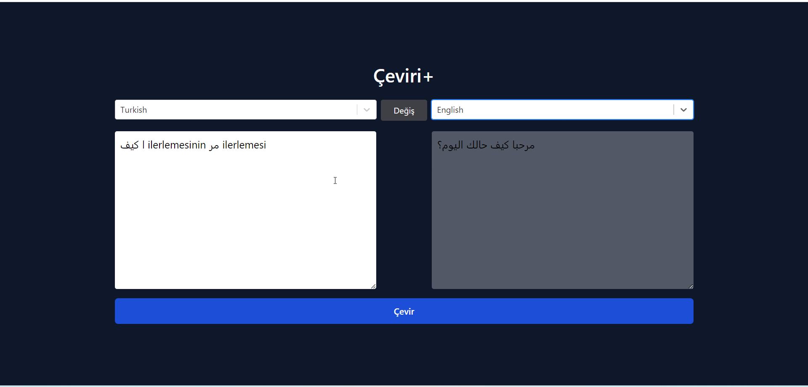

<h1>TRANSLATE-APPLICATION</h1>

  Introducing our latest web application: a cutting-edge translation platform powered by React-Toolkit Thunk.

Harnessing the power of APIs, our platform delivers swift and accurate translations for a wide range of languages. From documents to web pages, emails to social media posts, our translation tool ensures that language barriers are a thing of the past.

Just like our aircraft tracking radar system, this application provides an intuitive user interface, allowing users to effortlessly input text and receive instant translations. Whether you're a global business expanding your reach, a traveler navigating foreign languages, or simply someone eager to explore the world through different languages, our translation platform is your ultimate companion.

Experience the future of translation technology with our React-Toolkit Thunk-powered web application. Break language barriers and connect with the world like never before!

